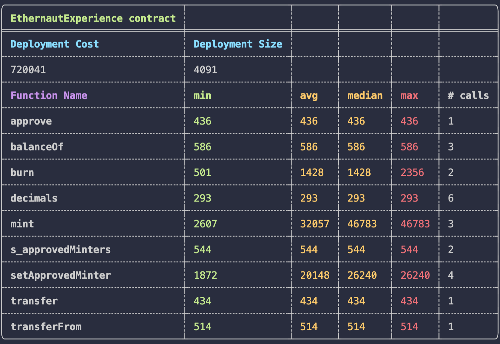

## Setup

You'll need the following:

- `RPC URL`: A URL to connect to the blockchain. You can get one for free from [Alchemy](https://www.alchemy.com/).
- `Private Key`: A private key from your wallet. You can get a private key from a new [Metamask](https://metamask.io/) account

## Deploying

```bash
forge create --rpc-url <your_rpc_url> --private-key <your_private_key> src/EthernautExperience.sol:EthernautExperience
```

## Gas Report


